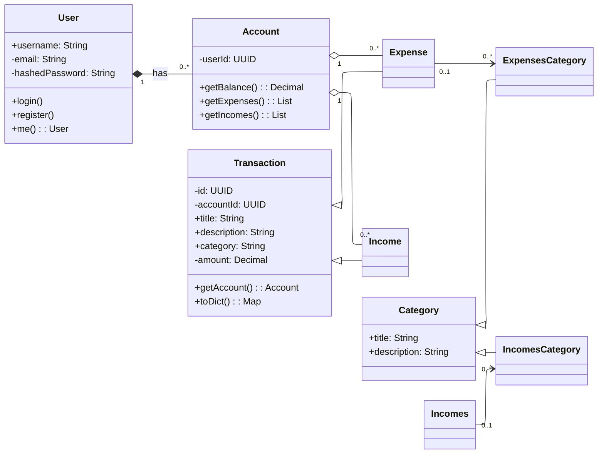

# Models Diagram

# Domain Model Overview

This document describes the main models and how they relate to each other.

---

## User
**Represents:**  
A person who uses the system.

**Details:**
- A user can create and manage accounts.
- Each user may have one or many accounts.

**Relationship:**
- One `User` has **one or more** `Account` objects (composition).

---

## Account
**Represents:**  
A user’s financial account (for example, a bank account or wallet).

**Details:**
- Tracks transactions such as incomes and expenses.
- Calculates balances, total incomes, and total expenses.

**Relationships:**
- Belongs to one `User`.
- Has many `Incomes` and `Expenses`.

---

## Transaction
**Represents:**  
A general financial record shared by both incomes and expenses.

**Details:**
- Stores information like title, description, amount, and category.
- Serves as a base class for `Incomes` and `Expenses`.

**Relationships:**
- Each transaction belongs to one `Account`.

---

## Incomes
**Represents:**  
Money added to an account.

**Details:**
- A specific type of transaction.
- Can be linked to an income category.

**Relationships:**
- Belongs to one `Account`.
- Can be assigned to one `IncomesCategory`.

---

## Expenses
**Represents:**  
Money spent from an account.

**Details:**
- A specific type of transaction.
- Can be linked to an expense category.

**Relationships:**
- Belongs to one `Account`.
- Can be assigned to one `ExpensesCategory`.

---

## Category
**Represents:**  
A general group used to organize transactions.

**Details:**
- Provides a title and description.
- Used as a base for income and expense categories.

---

## IncomesCategory
**Represents:**  
A category for classifying income records (for example, Salary or Bonus).

**Relationships:**
- Can be assigned to multiple `Incomes`.

---

## ExpensesCategory
**Represents:**  
A category for classifying expense records (for example, Food or Rent).

**Relationships:**
- Can be assigned to multiple `Expenses`.

---

## Summary of Relationships

| From | Relationship | To | Meaning |
|------|---------------|----|---------|
| User | *has* | Account | A user owns one or more accounts. |
| Account | *contains* | Incomes | An account stores multiple income records. |
| Account | *contains* | Expenses | An account stores multiple expense records. |
| Transaction | *base class of* | Incomes / Expenses | Shared structure for financial records. |
| Category | *base class of* | IncomesCategory / ExpensesCategory | Shared structure for classification. |
| Incomes | *linked to* | IncomesCategory | Each income may belong to one category. |
| Expenses | *linked to* | ExpensesCategory | Each expense may belong to one category. |

---

**In short:**  
- A **User** has **Accounts**.  
- Each **Account** records **Transactions** (either **Incomes** or **Expenses**).  
- **Categories** group those transactions by type or purpose.

Go back to [Project Overview](./project_overview.md).

