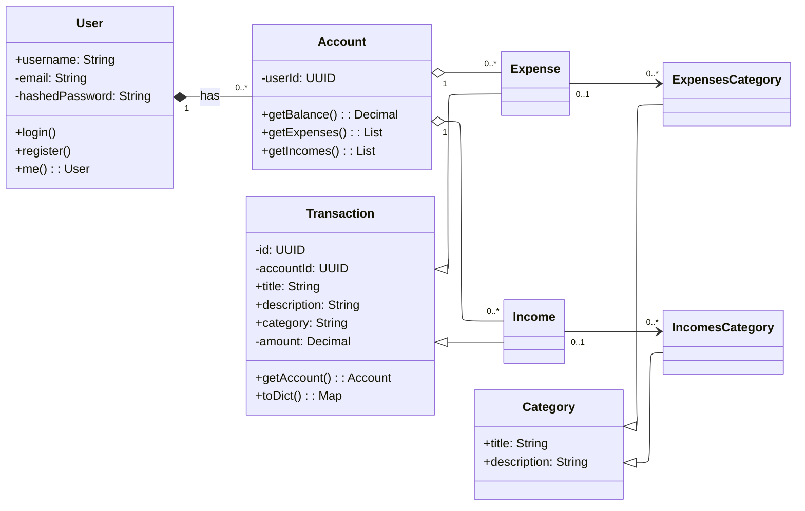

# Project Overview

This backend project provides a financial management API that allows users to register, manage accounts, record transactions, and organize them into categories.

---

## Project Structure


```plaintext
Backend/
├── prisma/                    # Prisma ORM configuration and schema
│   └── schema.prisma
│
├── docs/                      # Project documentation (architecture, specs, guides)
│
├── src/                       # Main application source code
│   ├── controllers/           # Manages response formatting and data presentation
│   ├── routes/                # Defines API routes and their handlers
│   ├── core/                  # Core system modules and essential logic
│   ├── templates/             # HTML templates for emails and message rendering
│   ├── app.ts                 # App initialization, middleware setup, configuration
│   ├── constants.ts           # Application-wide constants and configuration values
│   └── utils.ts               # General-purpose helper functions
│
├── index.ts                   # Entry point: bootstraps the server and main API logic
│
├── package.json               # Project dependencies and scripts
├── prisma.config.ts           # Prisma initialization and custom configuration
├── tsconfig.json              # TypeScript configuration
│
├── .env                       # Environment variables for development
├── .env.example               # Example template showing required environment variables
│
├── README.md                  # Main repository documentation
└── .gitignore                 # Specifies untracked files/folders
```

---

## Database Models


**Obs:** See the [Domain Model Overview](./models_diagram.md) for details on how the data is structured and related.

---

## Technologies Used

| Technology | Purpose | Description | URL |
|-------------|----------|-------------|-----|
| **PostgreSQL** | Database | A powerful open-source relational database system used to store and manage structured data. | https://www.postgresql.org/ |
| **Prisma** | ORM (Object Relational Mapping) | Simplifies database queries and schema management using a type-safe API. | https://www.prisma.io/ |
| **Express.js** | Web Framework | Provides routing and middleware for building RESTful APIs. | https://expressjs.com/ |
| **jsonwebtoken** | Authentication | Handles creation and verification of JWT tokens for user authentication. | https://github.com/auth0/node-jsonwebtoken |
| **bcrypt** | Security | Hashes and compares passwords for secure authentication. | https://github.com/kelektiv/node.bcrypt.js |
| **Jest** | Testing | Framework for running unit and integration tests with detailed reporting. | https://jestjs.io/ |
| **Supertest** | HTTP Testing | Enables end-to-end testing of HTTP servers and API endpoints. | https://github.com/ladjs/supertest |
| **nodemailer** | Email Delivery | Send transactional emails (verification, password reset, notifications) via SMTP or provider transports; configurable to work with services like SendGrid or Mailgun. | https://nodemailer.com/ |

---

## Main Routes (Quick Summary)

Base path: `/api`

- Authentication — `/api/auth/*`  
  register, verify-email, login, me (current user)
- Users — `/api/users/:id` or `/api/users/me`  
  get, update, delete (use "me" for owner operations)
- Accounts — `/api/accounts` and `/api/accounts/:accountId`  
  list, create, get, update, delete accounts for the authenticated user
- Transactions — `/api/accounts/:accountId/transactions` and `/api/accounts/:accountId/transactions/:txId`  
  list, create, get, update, delete transactions (income/expense) for an account
- Categories — `/api/categories/:type` and `/api/categories/:type/:catId`  
  list, create, update, delete categories (`type` = `expenses` | `incomes`)
- Reports — `/api/reports/*`  
  balance summary and transaction summaries between date ranges

For the full, up-to-date list of endpoints, examples and auth requirements see the API Routes document:

[See API Routes Overview](./api_routes.md)

---

## Overview

The system follows a modular structure:

- The **API layer** handles routing, requests, and responses.  
- The **Core layer** provides shared logic and configuration (database, constants, utilities).  
- The **Tests folder** ensures all features are verified automatically.  

Together, these components form a maintainable and scalable backend ready for production deployment.

Go back to [Readme](../README.md)

---
